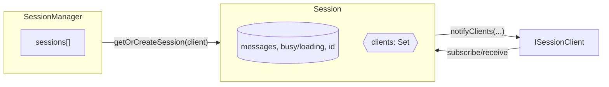
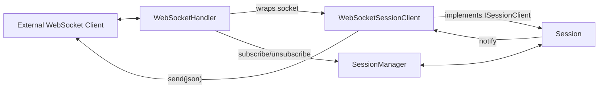
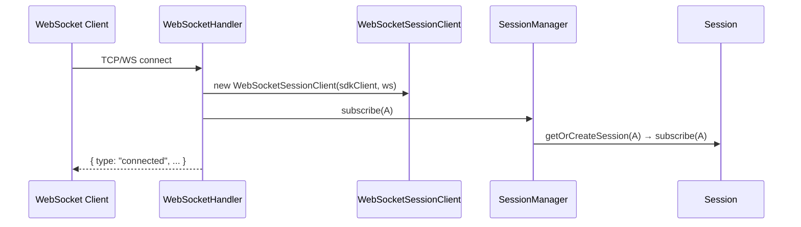
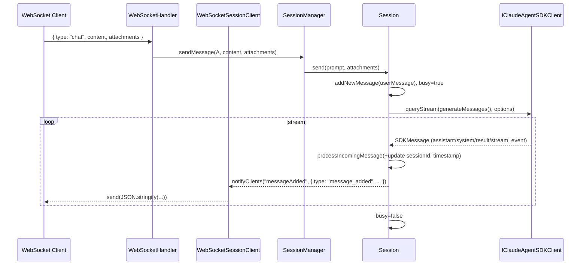
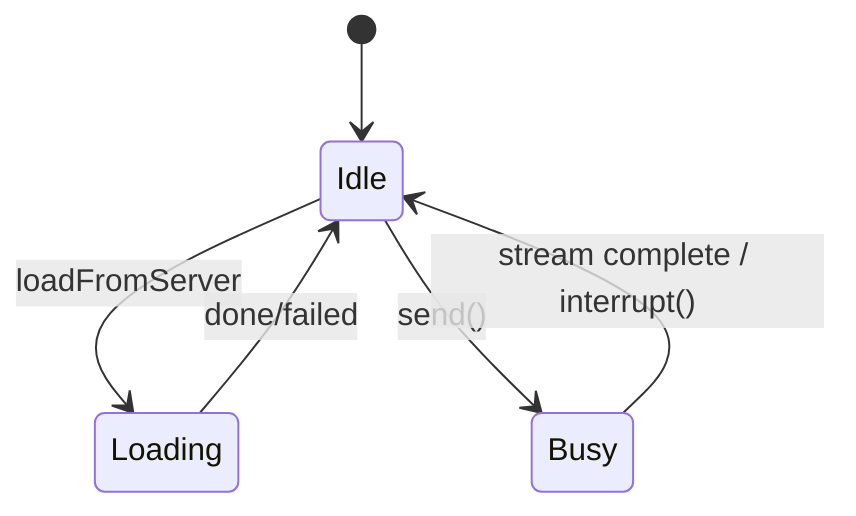

# Claude Agent Kit — System Design

This document explains the core runtime architecture under `src/`, focusing on how sessions are created, managed, and streamed over WebSocket. It highlights the relationships between Session, SessionClient, and SessionManager, and between WebSocketHandler, the external WebSocket client, and WebSocketSessionClient. Diagrams use Mermaid for clarity.

## Overview

At a high level, the system wires the Anthropic Claude Agent SDK into a sessioned, multi‑client real‑time experience:

- A Session represents a single Claude conversation lifecycle and state, backed by an `IClaudeAgentSDKClient` for streaming.
- A SessionManager owns many Session instances and helps (server‑side) clients find/create the right Session.
- A WebSocketHandler adapts WebSocket connections into Session clients using WebSocketSessionClient.
- The SimpleClaudeAgentSDKClient is a minimal `IClaudeAgentSDKClient` that calls the real SDK and can hydrate historical messages from JSONL session logs.

## Key Components

### Session

Source: `packages/server/src/server/session.ts:1`

- Holds per‑conversation state: `sessionId`, `messages`, `busyState`, `loadingState`, `usageSummary`, `thinkingLevel`, etc.
- Streams with `sdkClient.queryStream(...)` and appends messages via `processIncomingMessage`.
- Tracks in‑flight work using `queryPromise` and `AbortController` to prevent overlapping sends.
- Manages subscribers: a set of `ISessionClient` implementations, notified via `receiveSessionMessage(event, payload)` on updates:
  - `message_added`
  - `messages_updated`
  - `session_state_changed`
- Updates its `sessionId` when the SDK returns a message containing `session_id`, then syncs that id to all subscribers.

### SessionClient (ISessionClient)

Source: `packages/server/src/types/session.ts:22`

- A thin interface that server‑side client adapters implement to receive session updates:
  - Properties: `sessionId`, `sdkClient`.
  - Method: `receiveSessionMessage(event, message)`.
- Concrete implementation in this repo: `WebSocketSessionClient` (see below).

### SessionManager

Source: `packages/server/src/server/session-manager.ts:1`

- Owns and indexes multiple Session instances.
- Resolves a Session for a given `ISessionClient` (create if missing) and proxies operations:
  - `subscribe(client)`/`unsubscribe(client)`
  - `sendMessage(client, prompt, attachments)`
  - `setSDKOptions(client, options)`
- Sorts sessions by recency via `sessionsByLastModified`.

### IClaudeAgentSDKClient and SimpleClaudeAgentSDKClient

Sources: `packages/server/src/types/client.ts:1`, `packages/server/src/server/simple-cas-client.ts:1`

- `IClaudeAgentSDKClient` is the small adapter interface used by Session:
  - `queryStream(prompt|AsyncIterable, options?) → AsyncIterable<SDKMessage>`
  - `loadMessages(sessionId) → Promise<{ messages: SDKMessage[] }>`
- `SimpleClaudeAgentSDKClient` implements this interface by wrapping the real SDK query, and can read persisted JSONL session logs from `~/.claude/projects/**/<sessionId>.jsonl` to hydrate prior history.

### WebSocketHandler

Source: `packages/websocket/src/websocket-handler.ts:1`

- Wraps WebSocket server events (`open`, `message`, `close`).
- Maintains a `Map<WebSocket, WebSocketSessionClient>` to track connected peers.
- Creates one `WebSocketSessionClient` per socket and subscribes it to a Session via `SessionManager` on connect.
- Handles incoming control and chat messages from the wire, delegating to SessionManager:
  - `chat` → `sendMessage(client, content, attachments)`
  - `setSDKOptions` → `setSDKOptions(client, options)`
- Sends basic control frames like `{ type: "connected" }` and `{ type: "error", code }` directly.

### WebSocketSessionClient

Source: `packages/websocket/src/websocket-session-client.ts:1`

- Implements `ISessionClient` for a single WebSocket connection.
- Forwards `Session`’s outcoming messages to the wire by `webSocket.send(JSON.stringify(message))`.
- Holds a `sessionId` that is synced by `Session` whenever the Claude SDK assigns or updates it.

## Relationships

### Session, SessionClient, SessionManager

- SessionManager maps a logical client to a Session, creating one if necessary.
- Session owns the real‑time state and notifies all subscribed `ISessionClient`s when state changes.
- `ISessionClient` is the delivery mechanism for updates back to the outside world (e.g., WebSocket).

### WebSocket Handler, WebSocket Client, WebSocketSessionClient

- The external WebSocket client is any browser or service connected to the server.
- WebSocketHandler creates a WebSocketSessionClient for each socket and subscribes it to a Session via SessionManager.
- Session pushes updates to WebSocketSessionClient, which serializes and writes them back to the external client.

## Core Flows

### Connection Lifecycle

Notes

- On first connect, `A.sessionId` is typically `undefined`. Once Claude emits a `session_id`, `S` updates and syncs this id to all clients.

### Chat Streaming

## State Management

- Busy vs Loading
  - `busyState` is true while `send(...)` is streaming a reply.
  - `loadingState` is true while hydrating a session from history via `loadFromServer`.
- Concurrency control
  - `queryPromise` serializes `send(...)` calls: a second `send` waits for the first to finish.
  - `AbortController` enables `interrupt()` to cancel an in‑flight stream if needed.
- Timestamps
  - `lastModifiedTime` updates from message timestamps (string or number) or `Date.now()`.

## Persistence and Resume

- `SimpleClaudeAgentSDKClient.loadMessages(sessionId)` reads JSONL logs from `~/.claude/projects/**/<sessionId>.jsonl`, normalizes entries, and filters summaries.
- `Session.loadFromServer(sessionId?)` and `Session.resumeFrom(sessionId)` hydrate prior messages then mark the session loaded.
- WebSocket protocol in this repo does not yet expose an explicit "resume session by id" message; add one to call `Session.resumeFrom(id)` via `SessionManager` if needed.

## Message Model

- `buildUserMessageContent(prompt, attachments)` produces Claude‑compatible user content blocks:
  - Inline: `image/jpeg`, `image/png`, `image/gif`, `image/webp`
  - Text: `text/plain` (decoded from base64)
  - PDF: `application/pdf` (kept as base64)
- Outgoing session events to clients include:
  - `message_added`: single `SDKMessage`
  - `messages_updated`: full array of `SDKMessage`
  - `session_state_changed`: partial session info (`isBusy`, `isLoading`, `permissionMode`, `thinkingLevel`)

## Error Handling

- WebSocketHandler returns `{ type: "error", error, code }` for invalid JSON, empty content, or unsupported message types.
- File I/O during history load gracefully returns empty messages on `ENOENT`.

## Extensibility

- Plug a different `IClaudeAgentSDKClient` to customize tools, models, hooks, or persistence.
- Add protocol messages (e.g., `resume`, `interrupt`) and route them through `SessionManager` to `Session`.
- Add more renderable content types to `buildUserMessageContent` if needed.
