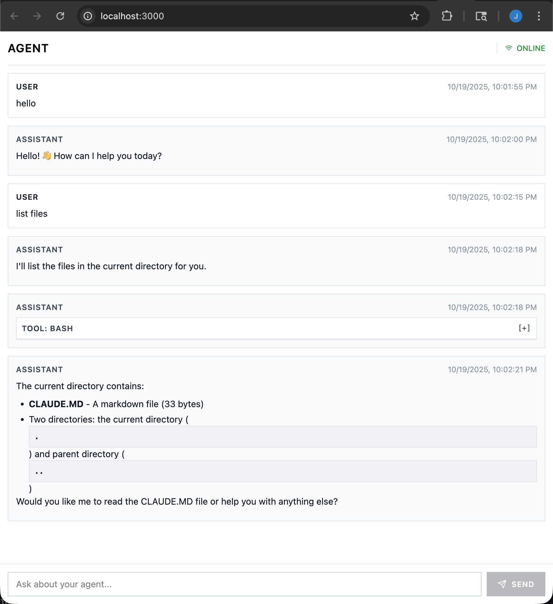

# Claude Agent SDK Basic Example

This project is a minimal end-to-end chat experience built on top of `@anthropic-ai/claude-agent-sdk`. It pairs a lightweight Bun server, a React client, and a streaming WebSocket bridge to show how to wire the SDK into a browser-based conversation UI.

The example ships with a starter system prompt (see `ccsdk/agent-prompt.ts`) and a dedicated agent workspace rooted at `./agent`, mirroring how a production Claude Agent project can keep its prompt and files organized.



## Features
- Streaming chat over WebSockets using `@anthropic-ai/claude-agent-sdk`.
- Bun-powered server that serves the client bundle and forwards messages to the SDK.
- React + Tailwind chat interface with session awareness.
- Agent workspace sandboxed to `./agent`, making it easy to iterate on notebooks, docs, and helper scripts alongside the project.

## Project Structure
- `ccsdk/` – thin wrappers around the Claude Agent SDK (prompt, AI client, session orchestration, WebSocket handler).
- `client/` – React UI rendered in the browser; connects to the WebSocket endpoint and displays chat transcripts.
- `server/` – Bun server with HTTP routes, WebSocket upgrade handler, and basic CSS/TS transpilation.
- `agent/` – working directory exposed to the Claude agent (add your notes, scripts, and other artifacts here).

## Prerequisites
- [Bun](https://bun.sh/) 1.1 or newer.
- An Anthropic API key exported as `ANTHROPIC_API_KEY` (or placed in a `.env` file that Bun can load).

## Getting Started
1. Install dependencies:
   ```bash
   bun install
   ```
2. Provide your Anthropic key:
   ```bash
   export ANTHROPIC_API_KEY=your-key-here
   ```
3. Start the dev server (serves both the Bun backend and the React frontend):
   ```bash
   bun run dev
   ```
4. Visit `http://localhost:3000` and start chatting. Messages are streamed to the browser from the SDK through the `/ws` WebSocket endpoint.

## Customizing the Agent
- **System prompt**: edit `ccsdk/agent-prompt.ts` to steer the model’s behavior for every session.
- **Workspace**: place notebooks, scripts, and other agent-visible files under `./agent`. The SDK is configured to run tools from this directory, matching the layout expected by Claude Agent projects.
- **Client UX**: tweak the React components under `client/` to adjust styling, message rendering, or session controls.
- **Server behavior**: extend `server/server.ts` or the helpers under `ccsdk/` to add REST endpoints, persist sessions, or integrate additional tooling.

With these pieces in place, you can rapidly iterate on a Claude Agent workflow while keeping the code and agent workspace close together.
